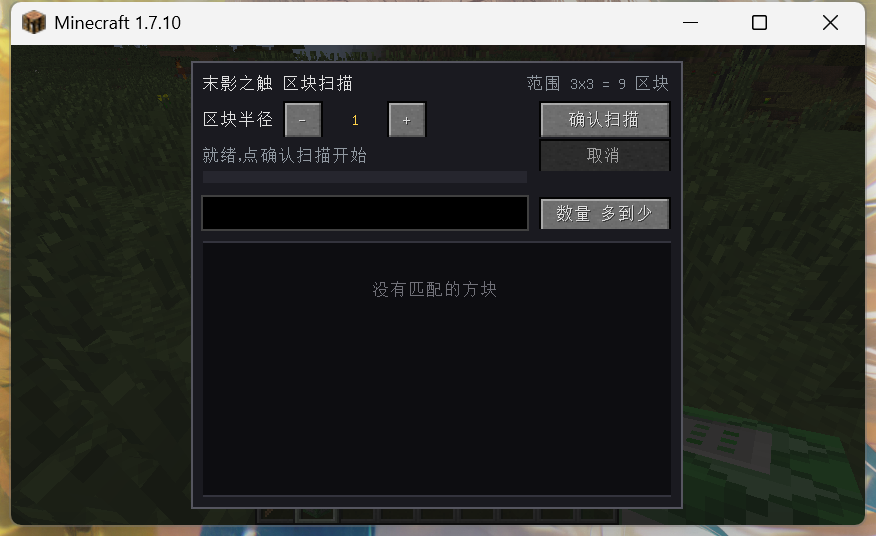
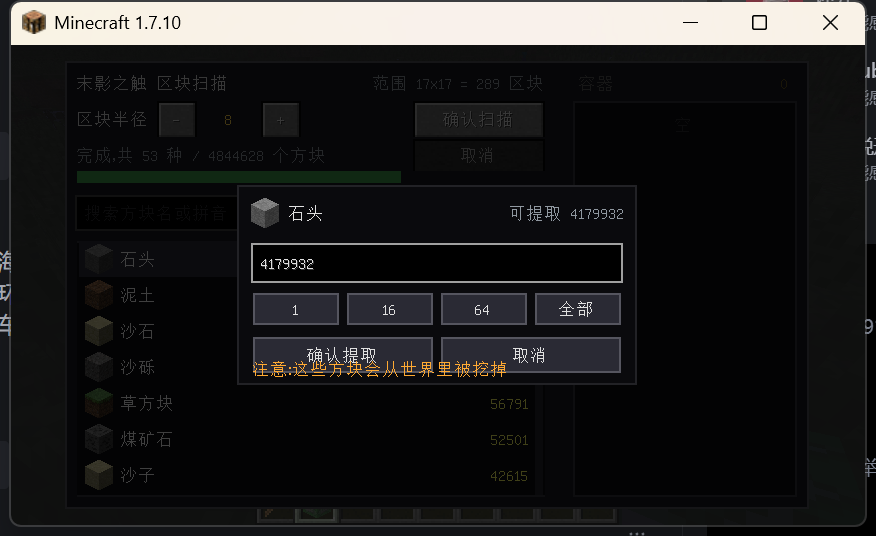
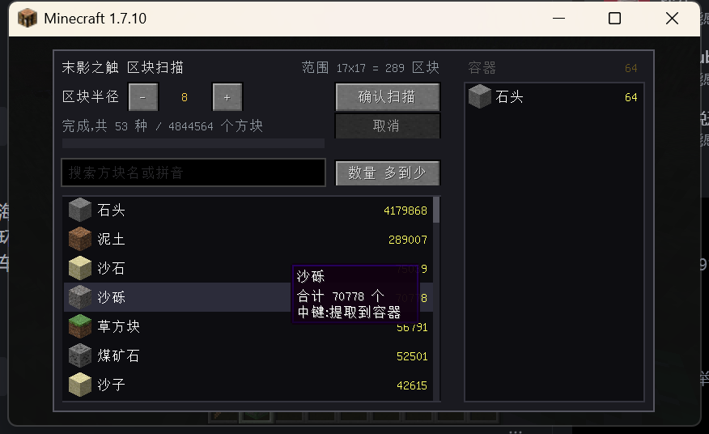
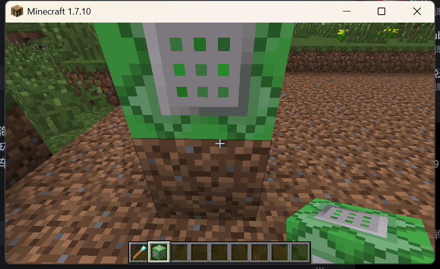

# PEEK Quarry — 末影之触

> Minecraft **1.7.10** + Forge **10.13.4.1614** 的一个小模组：加了一个会**扫描区块、统计方块、
> 把方块挖进自己的虚拟容器、再自动喂给隔壁箱子**的方块。

本仓库是 **without FE（Forge Energy）** 版本 —— 不含任何能量系统相关内容。
modid 仍然是 `peek_quarry`。

- 目标平台：Minecraft 1.7.10 / Forge 10.13.4.1614
- 构建工具链：RetroFuturaGradle 2.0.4 + Gradle 9.2.0
- 协议：[MIT](LICENSE)
- 版本：[1.0.0](CHANGELOG.md)

---

## 这是什么

「末影之触」是一个方块。右键它打开一个界面，里面有：

1. **扫描**：以这个方块所在区块为中心，把半径 N 个区块（N 可配 0–8，最大 17×17 = 289 个区块）
   范围内所有方块数一遍，按「方块 + metadata」分类计数。
2. **提取**：中键点统计列表里的某个方块，填个数量，确认 —— 服务端会**真的去世界里把这么多方块挖掉**，
   把战利品收进方块自己的容器。
3. **输出**：方块闲着的时候会自己把容器里的东西推进**相邻的容器**（箱子、漏斗、熔炉、模组机器…）。

换句话说，它是个**自带统计功能的采掘机 + 虚拟仓储**。

### 合成配方

```
铁块      末影之眼   铁块
末影之眼   钻石镐    末影之眼
铁块      末影之眼   铁块
```

用工作台摆成上面这样即可。

mod 启动时会做一次**配方自检** —— 拿一个 3×3 合成格按这个图案摆一遍，
问 `CraftingManager` 能不能配出这个方块，结果打进日志：

```
[PEEK Quarry] 末影之触配方已登记
[PEEK Quarry] 配方自检通过：按合成表摆出来的是 §aEnder's Touch
```

配方注册是最容易「静默失效」的一类问题（图案字符写错、材料用错，注册调用照样成功、
日志一行不报，只是玩家永远合不出来），所以有这道自检。改坏了日志里会直接出现
`配方自检失败`，不用进游戏手搓才发现。

---

## 截图

| 扫描界面 | 中键数量弹窗 |
|---|---|
|  |  |

| 提取后（统计同步减少，容器出现在右侧） | 世界里真的被挖掉了 |
|---|---|
|  |  |

更多实测截图在 [`docs/verify/`](docs/verify/)。

---

## 功能详解

### 区块扫描

- 半径 0–8，右上角实时显示覆盖范围（`范围 7x7 = 49 区块`）。
- 服务端用 `getChunkProvider().provideChunk()` **强制加载**范围内区块 ——
  **未生成过的会现场生成地形**，这是最慢、也最需要「取消」的场景。
- 统计按 **`Block` + `metadata`** 计数（所以水的不同流动等级、羊毛的不同颜色是分开的）。
- **剔除流体和基岩**：流体用「材质是液体」+ Forge 的 `IFluidBlock` 双重判断
  （只判断材质会漏掉实现 `IFluidBlock` 的模组液体）。要加别的排除项改
  `TileEntityEnderTouch.isExcluded()` 一行即可。
- 空气不计入。
- 分摊到多个 tick（每 tick 最多 12ms），带进度条，可随时取消并保留已扫到的部分。

### 搜索

结果列表支持三种输入：

| 输入 | 命中 |
|---|---|
| `石头` | 石头（中文子串，原行为） |
| `shitou` | 石头（全拼） |
| `st` | 石头（首字母缩写） |
| `kuang` | 煤矿石 / 铁矿石 / 红石矿石 / 金矿石 / 青金石矿石 / 钻石矿石 |
| `myzc` | 末影之触 |

- 拼音数据来自 **Unihan** 的 `kMandarin` / `kHanyuPinyin`，由
  [`tools/gen_pinyin_table.py`](tools/gen_pinyin_table.py) 生成成
  `assets/peek_quarry/pinyin.txt`（20901 字，jar 里压缩后约 90KB）。
  **按需懒加载** —— 只有客户端第一次搜索时才读，服务端永远不会加载到它；
  读不到就退化成纯文本匹配，不会崩。
- 多音字用「按偏离基准的字数递增」枚举组合，而不是暴力笛卡尔积：
  Unihan 的 `kHanyuPinyin` 按《汉语大字典》页码排序，会把生僻音放前面
  （`草` → `zào` 排在 `cǎo` 前），所以必须展开替换组合；但组合数随多音字数量指数增长，
  按偏离位数递增能让预算耗尽时留下**只改了一个字读音**的那批 —— 也就是真正可能命中的那批。
- `ü` 同时收 `lv` 和 `lu` 两种写法（`绿` → `lv`,`lu`）。
- **不支持中英/中拼混输**（例如 `shi头`）。纯中文、纯全拼、纯首字母都没问题。

### 提取入容器

中键点统计列表中的方块 → 弹窗（数量输入框 + `+1` / `+100` / `+1000` / `全部`，
**右键输入框清空**）→ 确认。

- **数量上限 = 扫描结果里还剩多少**，不会凭空生成，也不能超挖；超了会红字提示。
- **会真的改变世界**（不可逆，除非重新生成地形）。弹窗里有一行橙色提示说明这点。
- 挖掘顺序按到中心区块的切比雪夫距离排序，所以是**从方块身边向外扩散**的 ——
  默认的行优先顺序会让玩家眼前什么都看不到。
- 分摊到多个 tick（每 tick 最多 8ms / 512 个方块）。`World.setBlockToAir` 每个方块都会走一次
  `World.setBlock` 里的 `checkLight`，比单纯读方块贵好几个数量级，所以预算比扫描小。
- 中途取消：已挖的不会还原，但会照常进容器。

### 虚拟容器

容器**不是实体物品栏**，而是「种类 + 数量」的映射：

- 一次扫描能挖出几十万个方块，按 64 一摞要几千个槽位，实体物品栏放不下。
  侧边栏按数量降序列出，跟 AE2 存储单元一个概念。
- 侧边栏是**只读**的（没有取出 UI）。物品的出口是下面的主动输出。
- 内容写进 TileEntity 的 NBT，重进世界后还在。

### 主动输出到相邻容器

方块空闲时每 8 tick 尝试一次，六个面各最多送出 64 个：

- 只要相邻方块实现了 `IInventory` 就会送。
- 遵守 `ISidedInventory.getAccessibleSlotsFromSide` / `canInsertItem`，
  以及 `isItemValidForSlot`。
- 没有对应 `ItemStack` 的方块（甘蔗、农作物、水/岩浆）弹不出去，只能留在容器里。
- 扫描/提取进行中时**不**输出，免得两个任务抢同一份存储。
- 日志（都限流约 60 秒一条）：
  - 送成功：`输出 minecraft:dirt x64 -> (x, y, z)`
  - 送不出去：`(x, y, z) 待输出 N 种，相邻容器 M 个，本轮没送出去任何东西`
    —— `M = 0` 说明**旁边根本没有容器**（多半摆成了对角而不是共面），
    这是排查摆放问题最直接的一条。

---

## 安装

1. 装好 **Minecraft 1.7.10 + Forge 10.13.4.1614**。
2. 把 `peek_quarry-1.0.0.jar` 丢进 `mods/`。
3. 需要客户端和服务端都装。

> 注意整合包常开版本隔离，mod 目录在版本文件夹里而不是 `.minecraft/mods`。

---

## 从源码构建

### 需要什么

| 用途 | 版本 | 说明 |
|---|---|---|
| 跑 Gradle 本身 | **Java 25** | RFG 2.0.4 的 class 文件版本是 69.0（= Java 25）。用 17/21 会直接 `UnsupportedClassVersionError`。gradlew 通过 `JAVA_HOME` 找它。 |
| 编译 mod | **JDK 8** | RFG 默认 `jvmLanguageVersion = 8`，产出 `major=52`，1.7.10 才加载得了。Gradle 通过 toolchain 机制找它。 |
| RFG 内部任务 | JDK 21 | `:applyJST` 之类 |

### 步骤

```bash
# 1) 告诉 Gradle 去哪找 JDK。仓库里刻意不写死路径，请放在**全局**配置里：
#    Windows: %GRADLE_USER_HOME%\gradle.properties
#    Linux/macOS: ~/.gradle/gradle.properties
org.gradle.java.installations.paths=/path/to/jdk8,/path/to/jdk21,/path/to/jdk25
org.gradle.java.installations.auto-download=false

# 2) 设置 JAVA_HOME 指向 Java 25，然后
./gradlew build
```

Windows 上可以用仓库自带的 `dev.bat`（它不写死任何路径）：

```bat
:: 先在同目录建一个 local.env.bat（已在 .gitignore 里）：
::   set "JAVA_HOME=D:\jdk\zulu25"
::   set "GRADLE_USER_HOME=D:\gradle-home"

dev.bat build        :: 打包，产物在 build\libs\
dev.bat runClient    :: 起开发环境客户端
dev.bat runServer    :: 起开发环境服务端
dev.bat clean
dev.bat --status
```

产物：`build/libs/peek_quarry-1.0.0.jar`

---

## 目录结构

```
peek_quarry_without_FE/
├── build.gradle.kts / settings.gradle.kts / gradle.properties
├── dev.bat                       # 不写死路径的构建脚本（读 local.env.bat）
├── LICENSE                       # MIT
├── CHANGELOG.md
├── docs/
│   ├── DEV_NOTES.md              # 开发环境 + 1.7.10 实现坑 + 实测记录
│   └── verify/                   # 游戏内实测截图
├── tools/
│   ├── recolor_command_block.py  # 生成方块占位贴图（纯 Python，无需 Pillow）
│   ├── gen_pinyin_table.py       # 从 Unihan 生成拼音搜索用的汉字→拼音表
│   ├── prefetch_vanilla.py       # 预取原版 jar，规避 Mojang CDN 超时
│   └── verify_jar.py             # 校验产物字节码版本 / reobf 结果
└── src/main/
    ├── java/com/peek/quarry/
    │   ├── PeekQuarry.java           # 主类：@Mod + 生命周期 + 注册
    │   ├── BlockEnderTouch.java      # 「末影之触」方块
    │   ├── TileEntityEnderTouch.java # 扫描/提取/主动输出 + 虚拟存储 + NBT
    │   ├── BlockCount.java           # 统计条目（Block + meta + 数量）
    │   ├── PinyinHelper.java         # 汉字→拼音，供搜索框做拼音匹配
    │   ├── ContainerEnderTouch.java  # 进度用窗口属性同步
    │   ├── GuiEnderTouch.java        # 扫描 GUI + 容器侧边栏
    │   ├── GuiHandler.java           # GUI id → Container/Gui
    │   └── PacketHandler.java        # 网络通道 + 6 个消息
    └── resources/
        ├── mcmod.info
        └── assets/peek_quarry/
            ├── pinyin.txt            # 20901 字拼音表（生成物，别手改）
            ├── lang/{en_US,zh_CN}.lang
            └── textures/blocks/ender_touch.png   # 占位贴图
```

---

## 已知问题

**未验证：主动输出把物品真正塞进相邻容器的那一步。**
输出循环本身已被日志证实每 8 tick 在执行、遍历六个面并查找相邻 `IInventory`，
但「真的把物品塞进去」没有端到端跑通过 —— 开发机的键盘输入失效，无法可靠摆放容器。
**请帮忙验证**：放一个箱子**贴着**方块（共面，不是对角），看侧边栏是否开始减少；
日志出现 `输出 <方块> xN -> (x, y, z)` 就是通了。

其它：

- 「提取」只在单方块、单人、最多约 1.8 万个方块的场景下验证过。
- 未生成区块的现场地形生成路径没有被真正触发过（测试世界视距 12 > 半径上限 8）。
- `en_US` 语言文件没有在游戏内切换英文验证过。
- 方块贴图是**占位图**（原版命令方块染绿），不是正式美术。

开发环境相关的坑（JDK 分工、镜像、RFG 下载超时、reobf 命名约定等）见
[`docs/DEV_NOTES.md`](docs/DEV_NOTES.md)。

---

## 协议

[MIT](LICENSE) © 2026 cao1030
